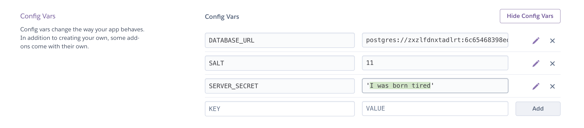

#  SOFTWARE ENGINEERING IMMERSIVE

# rails-react-deployment

## Back end deployment:

Change the secret key line inside of `app/controllers/application_controller.rb` to look like this:

```ruby
  SECRET_KEY = Rails.env == 'production' ? ENV['SECRET_KEY'] : Rails.application.secrets.secret_key_base.to_s
```

Then in terminal from the root of your rails app/project repo:

`heroku create <name of your backend>`

*example*:
`heroku create tasteville-api`

This will add a heroku remote link to your git repo. You can double check that it's there with `git remote -v`.

We also need to set a `SECRET_KEY` env var on the heroku website. You can select your new heroku project from the heroku website dashboard. Once selected, click onto the "Settings" tab and scroll down until you see a "reveal Config Vars" button. Clicking that button should reveal all of the env vars for the app. We can simply add a new one that matches "SECRET_KEY" and the value can be any string.

*example*:



Next we need to push up our changes to the heroku remote.
> **Please Note:** this will only push the master branch. It wont push up any other branch.

```bash
git add -A
git commit -m "message here"
git push heroku master
```

<details>
<summary>Code for if you have a nested rails app:</summary>

<hr />

Instead of `git push heroku master` run this line:

```bash
git subtree push --prefix=my/folder heroku master
```
*example*:
```bash
git subtree push --prefix=./school-app heroku master
```
<hr />

</details>
<br />

This will push up your code to the deployment server which already has a blank database. Next we need to run our migrations and seed on the production DB:

```bash
heroku run rails db:migrate
heroku run rails db:seed
```

## Front end deployment:


First change your `api-helper.js` file to looks like this:

```js
const baseUrl = process.env.NODE_ENV === 'production' ? /* link to your heroku app. Example:*/'https://school-app-test.herokuapp.com/' : 'http://localhost:3000' 

const api = axios.create({
  baseURL: baseUrl
})
```

### Surge

In terminal from inside of your react directory:

```bash
npm run build
cd build/
mv index.html  200.html
surge
```

### Netlify

- Once you are logged into your netlify account on netlify.com,
click on the "New site from Git"

- choose "GitHub" under the Continuous Deployment section

- Select your repo from the list.

- On the next screen we will need to define the build settings:
  - build command: `npm run build`
  - publish directory: `build/`

- Then click "deploy". This will fail

- we need to edit the base directory for our app. Let's click on "Site settings"

- In the "Build & Deploy" tab there is a "Build settings" section. Click "Edit settings" on this section

- last change we need to make is to set the "Base directory" to `client/` and "save"

- We're now ready to re-deploy our app. Back in the main "Overview" section for our app, click on "Production deploys" and then "trigger deploy" - "deploy site"
